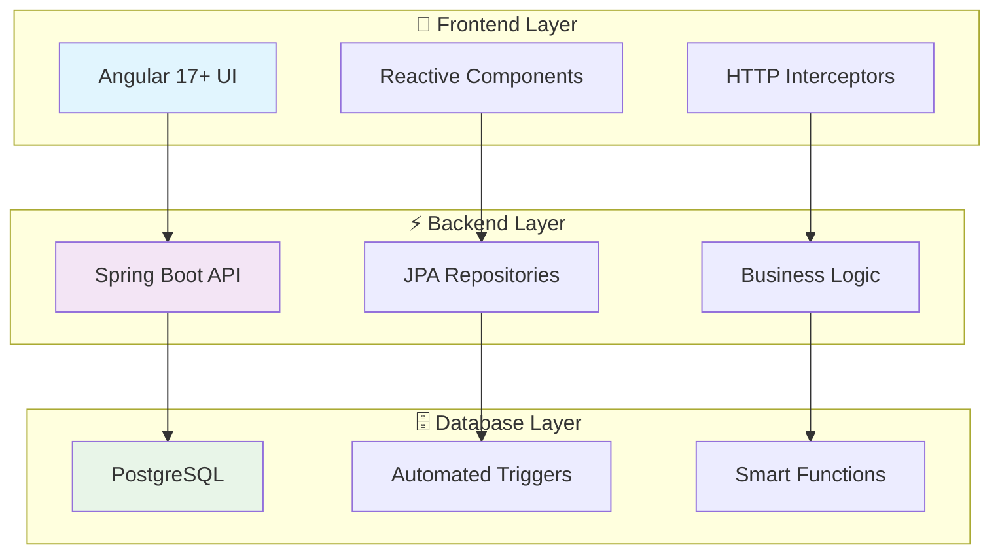
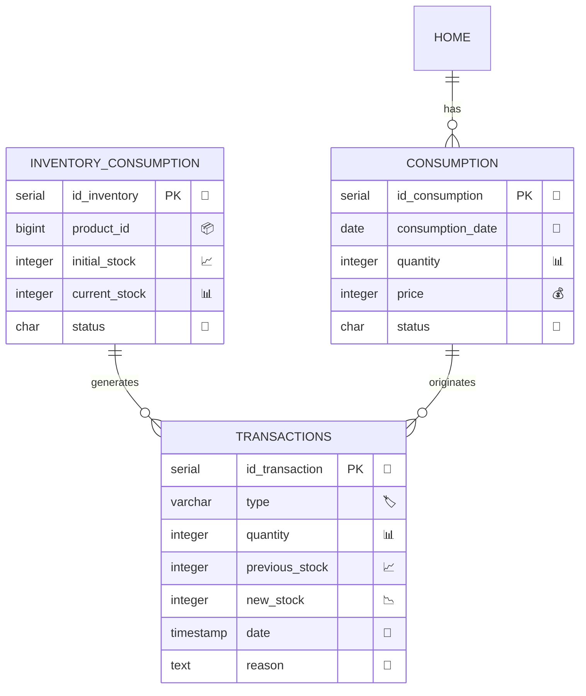
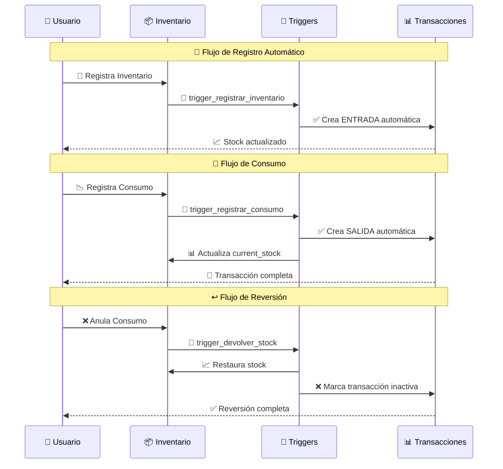
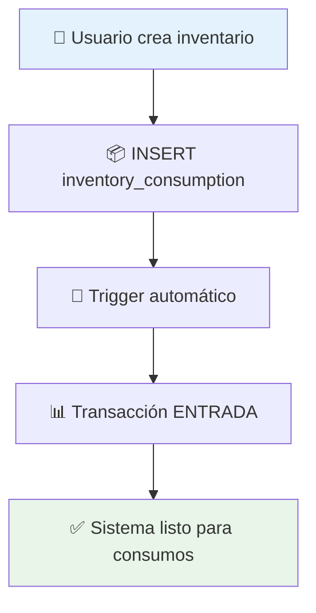
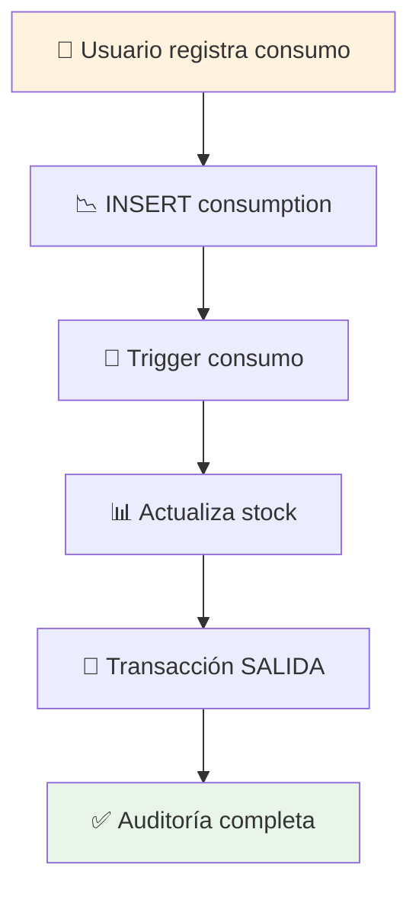

<div align="center">

# 🚀 Sistema de Gestión de Inventario & Transacciones


### 💎 **Sistema Enterprise de Control Automatizado**
*Gestión inteligente de inventario con transacciones automáticas y auditoría completa*

[🎯 Demo Live](#) • [📚 Documentación](#) • [🐛 Issues](#) • [💬 Discussions](#)

</div>

---

## 🌟 **Características Premium**

<table>
<tr>
<td width="50%">

### 🎯 **Inventario Inteligente**
- ✅ **Control de Stock Automático**
- ✅ **Validaciones en Tiempo Real**
- ✅ **Alertas de Stock Crítico**
- ✅ **Auditoría Completa 360°**

</td>
<td width="50%">

### 🔄 **Transacciones Avanzadas**
- ✅ **Sistema de Triggers Automáticos**
- ✅ **4 Tipos de Movimientos**
- ✅ **Trazabilidad Total**
- ✅ **Reversión Inteligente**

</td>
</tr>
</table>

---

## 🏗️ **Arquitectura del Sistema**



---

## 📊 **Modelo de Datos Inteligente**

### 🎯 **Entidades Principales**

<div align="center">



</div>

---

## 🚀 **Funcionalidades Core Implementadas**

<div align="center">

### 🎯 **GESTIÓN DE INVENTARIO**

</div>

<table>
<tr>
<td width="25%" align="center">

### 📦 **Registro**
```sql
INSERT INTO inventory_consumption
VALUES (product_id, stock, stock, 'A');
```
**✅ Automático**  
**✅ Validado**

</td>
<td width="25%" align="center">

### 📊 **Control Stock**
```sql
UPDATE inventory_consumption
SET current_stock = new_value;
```
**✅ Tiempo Real**  
**✅ Triggers**

</td>
<td width="25%" align="center">

### 🔄 **Actualización**
```sql
-- Trigger automático
-- registra ENTRADA
```
**✅ Automático**  
**✅ Auditado**

</td>
<td width="25%" align="center">

### 📈 **Reportes**
```sql
SELECT * FROM vw_transactions
ORDER BY date DESC;
```
**✅ Vista SQL**  
**✅ Optimizada**

</td>
</tr>
</table>

---

<div align="center">

### 🔄 **SISTEMA DE TRANSACCIONES**

</div>

<table>
<tr>
<td width="25%" align="center">

### 📈 **ENTRADA**
<div style="background: linear-gradient(45deg, #4CAF50, #8BC34A); padding: 20px; border-radius: 10px; color: white; font-weight: bold;">
Stock Inicial<br>
Reposiciones<br>
Ajustes +
</div>

</td>
<td width="25%" align="center">

### 📉 **SALIDA**
<div style="background: linear-gradient(45deg, #F44336, #FF5722); padding: 20px; border-radius: 10px; color: white; font-weight: bold;">
Consumos<br>
Ventas<br>
Distribución
</div>

</td>
<td width="25%" align="center">

### ⚖️ **AJUSTE**
<div style="background: linear-gradient(45deg, #FF9800, #FFC107); padding: 20px; border-radius: 10px; color: white; font-weight: bold;">
Correcciones<br>
Inventario Físico<br>
Calibración
</div>

</td>
<td width="25%" align="center">

### 💥 **DAÑO**
<div style="background: linear-gradient(45deg, #9C27B0, #E91E63); padding: 20px; border-radius: 10px; color: white; font-weight: bold;">
Productos Dañados<br>
Vencimientos<br>
Pérdidas
</div>

</td>
</tr>
</table>

---

## ⚡ **Sistema de Triggers Automáticos**

<div align="center">

### 🎯 **Flujo de Automatización**

</div>



---

## 🎨 **Stack Tecnológico Premium**

<div align="center">

<table>
<tr>
<td align="center" width="33%">

### 🎯 **Frontend**
<br>
<br>


</td>
<td align="center" width="33%">

### ⚡ **Backend**
<br>
<br>


</td>
<td align="center" width="33%">

### 🗄️ **Database**
<br>
<br>


</td>
</tr>
</table>

</div>

---

## 📋 **Funciones SQL Implementadas**

<details>
<summary><strong>🔄 registrar_transaccion_consumo()</strong></summary>

```sql
-- ✅ Se ejecuta automáticamente al insertar consumo
-- 🎯 Actualiza stock y crea transacción SALIDA
-- 🔒 Solo para consumos activos (status = 'A')

CREATE OR REPLACE FUNCTION registrar_transaccion_consumo()
RETURNS TRIGGER AS $$
DECLARE
    prev_stock INTEGER;
    inv_id INTEGER;
BEGIN
   IF NEW.status = 'A' THEN
      -- Stock anterior y ID inventario
      SELECT id_inventory, current_stock INTO inv_id, prev_stock
      FROM inventory_consumption WHERE product_id = NEW.product_id;

      -- Actualizar inventario
      UPDATE inventory_consumption
      SET current_stock = current_stock - NEW.quantity
      WHERE product_id = NEW.product_id;

      -- Registrar transacción automática
      INSERT INTO transactions (...)
      VALUES (...);
   END IF;
   RETURN NEW;
END;
$$ LANGUAGE plpgsql;
```

</details>

<details>
<summary><strong>↩️ devolver_stock()</strong></summary>

```sql
-- ✅ Se ejecuta al cambiar status de consumo a inactivo
-- 🎯 Revierte el stock automáticamente
-- 📊 Marca transacciones como anuladas

CREATE OR REPLACE FUNCTION devolver_stock()
RETURNS TRIGGER AS $$
BEGIN
   IF NEW.status = 'I' AND OLD.status = 'A' THEN
      -- Devolver stock al inventario
      UPDATE inventory_consumption
      SET current_stock = current_stock + OLD.quantity
      WHERE product_id = OLD.product_id;

      -- Marcar transacción como anulada
      UPDATE transactions SET status = 'I'
      WHERE consumption_id = OLD.id_consumption;
   END IF;
   RETURN NEW;
END;
$$ LANGUAGE plpgsql;
```

</details>

<details>
<summary><strong>📈 registrar_transaccion_inventario()</strong></summary>

```sql
-- ✅ Se ejecuta automáticamente al crear inventario
-- 🎯 Registra transacción ENTRADA inicial
-- 📊 Establece stock base del producto

CREATE OR REPLACE FUNCTION registrar_transaccion_inventario()
RETURNS TRIGGER AS $$
BEGIN
   INSERT INTO transactions (
      inventory_id, product_id, type, quantity,
      previous_stock, new_stock, reason, status
   )
   VALUES (
      NEW.id_inventory, NEW.product_id, 'ENTRADA',
      NEW.initial_stock, 0, NEW.current_stock,
      'Registro de inventario inicial', 'A'
   );
   RETURN NEW;
END;
$$ LANGUAGE plpgsql;
```

</details>

---

## 🚀 **Quick Start**

### 1️⃣ **Configuración de Base de Datos**

```bash
# 📋 Crear base de datos
createdb inventory_system

# 🔧 Ejecutar script SQL
psql -d inventory_system -f database_setup.sql
```

### 2️⃣ **Backend Setup**

```bash
# 📦 Instalar dependencias
mvn clean install

# ⚡ Configurar application.yml
spring:
  datasource:
    url: jdbc:postgresql://localhost:5432/inventory_system
    username: ${DB_USER}
    password: ${DB_PASSWORD}

# 🚀 Ejecutar aplicación
mvn spring-boot:run
```

### 3️⃣ **Frontend Setup**

```bash
# 📦 Instalar dependencias
npm install

# 🎨 Configurar environment
export const environment = {
  apiUrl: 'http://localhost:8080/api'
};

# 🚀 Ejecutar aplicación
ng serve
```

---

## 📊 **API Endpoints Disponibles**

<div align="center">

### 🎯 **Inventario Endpoints**

</div>

| Método | Endpoint | Descripción | Status |
|--------|----------|-------------|---------|
| `GET` | `/api/inventory` | 📋 Listar inventario | ✅ Activo |
| `POST` | `/api/inventory` | 📦 Crear inventario | ✅ Activo |
| `PUT` | `/api/inventory/{id}` | 🔄 Actualizar stock | ✅ Activo |
| `DELETE` | `/api/inventory/{id}` | ❌ Eliminar inventario | ✅ Activo |

<div align="center">

### 🔄 **Transacciones Endpoints**

</div>

| Método | Endpoint | Descripción | Status |
|--------|----------|-------------|---------|
| `GET` | `/api/transactions` | 📊 Historial completo | ✅ Activo |
| `GET` | `/api/transactions/filter` | 🔍 Filtros avanzados | ✅ Activo |
| `GET` | `/api/transactions/report` | 📄 Generar PDF | ✅ Activo |

---

## 🎯 **Casos de Uso Implementados**

<table>
<tr>
<td width="50%">

### 📦 **Registro de Inventario**


</td>
<td width="50%">

### 🔄 **Procesamiento de Consumo**


</td>
</tr>
</table>

---

## 🛠️ **Validaciones y Constraints**

<div align="center">

### 🔒 **Sistema de Validaciones Robusto**

</div>

| Validación | Tipo | Descripción | Implementado |
|------------|------|-------------|--------------|
| **Stock ≥ 0** | `CHECK` | Evita stock negativo | ✅ |
| **Cantidad > 0** | `CHECK` | Solo cantidades válidas | ✅ |
| **Status válido** | `CHECK` | Solo 'A' o 'I' permitidos | ✅ |
| **Tipo transacción** | `CHECK` | Solo tipos definidos | ✅ |
| **Integridad referencial** | `FK CASCADE` | Mantiene consistencia | ✅ |

---

## 📈 **Métricas y Monitoreo**

<div align="center">

### 🎯 **Vista de Transacciones Optimizada**

</div>

```sql
-- 🚀 Vista SQL optimizada para reportes
CREATE OR REPLACE VIEW vw_transactions AS
SELECT 
    t.id_transaction,
    t.type,
    t.quantity,
    t.previous_stock,
    t.new_stock,
    t.date,
    t.reason,
    ic.product_id
FROM transactions t
JOIN inventory_consumption ic ON t.inventory_id = ic.id_inventory
ORDER BY t.date DESC;
```

---

## 🎨 **Screenshots del Sistema**

<div align="center">

### 📊 **Dashboard Principal**
*[Screenshot placeholder - Dashboard con métricas en tiempo real]*

### 📦 **Gestión de Inventario**
*[Screenshot placeholder - Interfaz de inventario con filtros]*

### 🔄 **Historial de Transacciones**
*[Screenshot placeholder - Lista de transacciones con paginación]*

</div>

---

## 🔧 **Troubleshooting**

<details>
<summary><strong>❗ Error: Stock negativo</strong></summary>

**Problema:** `ERROR: new row for relation violates check constraint`

**Solución:**
```sql
-- Verificar stock disponible antes del consumo
SELECT current_stock FROM inventory_consumption WHERE product_id = X;
```

</details>

<details>
<summary><strong>⚠️ Trigger no ejecuta</strong></summary>

**Problema:** Las transacciones no se crean automáticamente

**Solución:**
```sql
-- Verificar que los triggers estén activos
SELECT * FROM information_schema.triggers;
```

</details>

---

## 📝 **Roadmap Futuro**

- [ ] 🔔 **Sistema de Notificaciones**
- [ ] 📊 **Dashboard Analytics Avanzado**
- [ ] 🔍 **Búsqueda Full-Text**
- [ ] 🌐 **API GraphQL**
- [ ] 📱 **App Mobile**
- [ ] 🤖 **Predicción de Demanda con IA**

---

## 👥 **Contribuciones**

<div align="center">

¿Quieres contribuir? ¡Genial! 🎉

<a href="#" style="text-decoration: none;">
  
</a>

1. 🍴 **Fork** el repositorio
2. 🌿 **Crea** tu branch de feature
3. 💾 **Commit** tus cambios
4. 📤 **Push** al branch
5. 🎯 **Abre** un Pull Request

</div>

---

<div align="center">

## 💎 **¿Te gusta el proyecto?**

<a href="#" style="text-decoration: none;">
  
</a>
<a href="#" style="text-decoration: none;">
  
</a>
<a href="#" style="text-decoration: none;">
  
</a>

---

### 🎯 **Sistema de Inventario Premium**
*Desarrollado con ❤️ para la excelencia empresarial*

**[⬆ Volver arriba](#-sistema-de-gestión-de-inventario--transacciones)**

</div>
