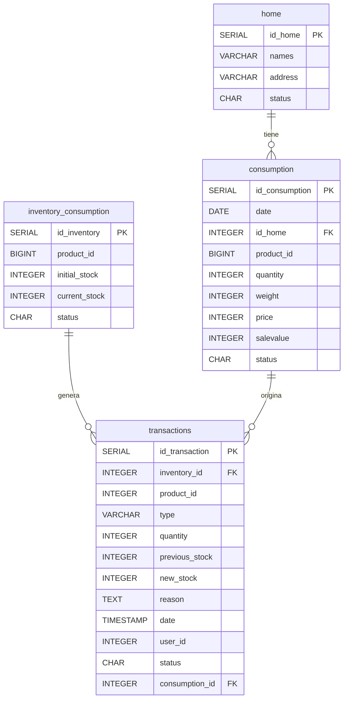

# Sistema de Gestión de Inventario y Consumo

## 📋 Descripción General

El Sistema de Gestión de Inventario y Consumo es una aplicación empresarial desarrollada para optimizar el control y seguimiento de productos en múltiples ubicaciones. La solución permite gestionar de manera integral el inventario, registrar consumos por hogar/ubicación y mantener un historial completo de transacciones.

## 🏗️ Arquitectura del Sistema

### Stack Tecnológico
- **Backend**: Spring Boot 3.x
- **Frontend**: Angular 17+
- **Base de Datos**: PostgreSQL 15+
- **Documentación**: OpenAPI/Swagger
- **Reportes**: Generación de PDF

### Arquitectura de Capas
```
┌─────────────────────────────────────┐
│           Frontend (Angular)        │
│  - Componentes                      │
│  - Servicios                        │
│  - Guards & Interceptors            │
└─────────────────────────────────────┘
                    │
                HTTP/REST
                    │
┌─────────────────────────────────────┐
│         Backend (Spring Boot)       │
│  - Controllers                      │
│  - Services                         │
│  - Repositories                     │
│  - DTOs & Entities                  │
└─────────────────────────────────────┘
                    │
                 JPA/JDBC
                    │
┌─────────────────────────────────────┐
│        Base de Datos (PostgreSQL)   │
│  - Tablas                           │
│  - Triggers                         │
│  - Funciones                        │
│  - Vistas                           │
└─────────────────────────────────────┘
```

## 🗃️ Modelo de Base de Datos

### Diagrama de Entidades



### Descripción de Tablas

#### `home`
Gestiona las ubicaciones o hogares donde se realiza el consumo.

| Campo | Tipo | Descripción |
|-------|------|-------------|
| `id_home` | SERIAL | Identificador único del hogar |
| `names` | VARCHAR(50) | Nombre del hogar |
| `address` | VARCHAR(100) | Dirección del hogar |
| `status` | CHAR(1) | Estado: 'A' (Activo) o 'I' (Inactivo) |

#### `inventory_consumption`
Controla el inventario disponible de productos.

| Campo | Tipo | Descripción |
|-------|------|-------------|
| `id_inventory` | SERIAL | Identificador único del inventario |
| `product_id` | BIGINT | Identificador del producto |
| `initial_stock` | INTEGER | Stock inicial registrado |
| `current_stock` | INTEGER | Stock actual disponible |
| `status` | CHAR(1) | Estado: 'A' (Activo) o 'I' (Inactivo) |

#### `consumption`
Registra los consumos realizados por cada hogar.

| Campo | Tipo | Descripción |
|-------|------|-------------|
| `id_consumption` | SERIAL | Identificador único del consumo |
| `date` | DATE | Fecha del consumo |
| `id_home` | INTEGER | Referencia al hogar |
| `product_id` | BIGINT | Identificador del producto consumido |
| `quantity` | INTEGER | Cantidad consumida |
| `weight` | INTEGER | Peso del producto |
| `price` | INTEGER | Precio unitario |
| `salevalue` | INTEGER | Valor total de la venta |
| `status` | CHAR(1) | Estado: 'A' (Activo) o 'I' (Anulado) |

#### `transactions`
Auditoría completa de movimientos de inventario.

| Campo | Tipo | Descripción |
|-------|------|-------------|
| `id_transaction` | SERIAL | Identificador único de la transacción |
| `inventory_id` | INTEGER | Referencia al inventario |
| `product_id` | INTEGER | Identificador del producto |
| `type` | VARCHAR(20) | Tipo: ENTRADA, SALIDA, AJUSTE, DAÑO |
| `quantity` | INTEGER | Cantidad del movimiento |
| `previous_stock` | INTEGER | Stock anterior |
| `new_stock` | INTEGER | Stock resultante |
| `reason` | TEXT | Motivo del movimiento |
| `date` | TIMESTAMP | Fecha y hora de la transacción |
| `user_id` | INTEGER | Usuario que realizó la transacción |
| `status` | CHAR(1) | Estado: 'A' (Activo) o 'I' (Inactivo) |
| `consumption_id` | INTEGER | Referencia al consumo (si aplica) |

## 🔧 Funcionalidades del Sistema

### 1. Gestión de Inventario
- **Registro de productos**: CRUD completo para productos
- **Control de stock**: Seguimiento automático de existencias
- **Alertas de stock mínimo**: Notificaciones de reposición
- **Ajustes de inventario**: Correcciones manuales con justificación

### 2. Registro de Consumos
- **Consumo por hogar**: Asignación de consumos a ubicaciones específicas
- **Cálculo automático**: Actualización instantánea del inventario
- **Anulación de consumos**: Reversión automática del stock
- **Validaciones**: Control de stock disponible antes del consumo

### 3. Sistema de Transacciones
- **Auditoría completa**: Registro automático de todos los movimientos
- **Tipos de transacciones**:
  - `ENTRADA`: Ingreso de mercancía
  - `SALIDA`: Consumo o venta
  - `AJUSTE`: Correcciones de inventario
  - `DAÑO`: Productos dañados o vencidos
- **Trazabilidad**: Historial completo de cambios

### 4. Reportes y Analytics
- **Reportes en PDF**: Generación automática de documentos
- **Filtros avanzados**: Por fecha, tipo de movimiento, producto, hogar
- **Dashboards**: Visualización de métricas clave
- **Exportación de datos**: Formato CSV, Excel, PDF

## 🚀 Funciones y Triggers Automáticos

### Triggers Implementados

#### `trigger_registrar_consumo`
```sql
-- Se ejecuta DESPUÉS de insertar un consumo
-- Función: registrar_transaccion_consumo()
```
- **Propósito**: Actualiza automáticamente el inventario al registrar un consumo
- **Acción**: Crea una transacción tipo SALIDA y reduce el stock actual

#### `trigger_devolver_stock`
```sql
-- Se ejecuta DESPUÉS de actualizar un consumo
-- Función: devolver_stock()
```
- **Propósito**: Revierte el stock cuando se anula un consumo
- **Acción**: Restaura las cantidades al inventario y marca la transacción como inactiva

#### `trigger_registrar_inventario`
```sql
-- Se ejecuta DESPUÉS de insertar inventario
-- Función: registrar_transaccion_inventario()
```
- **Propósito**: Registra automáticamente el inventario inicial
- **Acción**: Crea una transacción tipo ENTRADA con el stock inicial

#### `trigger_actualizacion_inventario`
```sql
-- Se ejecuta DESPUÉS de actualizar inventario
-- Función: registrar_actualizacion_inventario()
```
- **Propósito**: Audita los incrementos de stock
- **Acción**: Registra transacciones ENTRADA cuando aumenta el inventario

## 📊 Vistas del Sistema

### `vw_transactions`
Vista optimizada para consulta de transacciones con información consolidada:
```sql
CREATE OR REPLACE VIEW vw_transactions AS
SELECT 
    t.id_transaction,
    t.inventory_id,
    t.product_id AS transaction_product_id,
    t.type,
    t.quantity,
    t.previous_stock,
    t.new_stock,
    t.reason,
    t.date,
    t.user_id,
    t.status,
    t.consumption_id,
    ic.product_id AS inventory_product_id
FROM transactions t
JOIN inventory_consumption ic ON t.inventory_id = ic.id_inventory
ORDER BY t.date DESC;
```

## 🔒 Seguridad y Validaciones

### Constraints de Base de Datos
- **Stock no negativo**: `CHECK (current_stock >= 0)`
- **Cantidades positivas**: `CHECK (quantity > 0)`
- **Estados válidos**: `CHECK (status IN ('A', 'I'))`
- **Tipos de transacción válidos**: `CHECK (type IN ('ENTRADA', 'SALIDA', 'AJUSTE', 'DAÑO'))`

### Integridad Referencial
- **Cascada en eliminación**: `ON DELETE CASCADE`
- **Claves foráneas**: Mantenimiento automático de relaciones
- **Validación de existencias**: Control de stock disponible

## 📈 Casos de Uso

### Caso 1: Registro de Nuevo Inventario
1. Se inserta un producto en `inventory_consumption`
2. Se ejecuta `trigger_registrar_inventario`
3. Se crea automáticamente una transacción tipo ENTRADA
4. El sistema queda listo para consumos

### Caso 2: Registro de Consumo
1. Se registra un consumo en la tabla `consumption`
2. Se ejecuta `trigger_registrar_consumo`
3. Se valida el stock disponible
4. Se actualiza `current_stock` en `inventory_consumption`
5. Se crea una transacción tipo SALIDA

### Caso 3: Anulación de Consumo
1. Se actualiza el status del consumo a 'I'
2. Se ejecuta `trigger_devolver_stock`
3. Se restaura el stock en el inventario
4. Se marca la transacción relacionada como inactiva

## 🛠️ Instalación y Configuración

### Requisitos del Sistema
- Java 17+
- Node.js 18+
- PostgreSQL 15+
- Maven 3.8+

### Configuración de Base de Datos
```sql
-- Ejecutar el script SQL proporcionado
-- Este incluye:
-- 1. Creación de tablas
-- 2. Definición de triggers y funciones
-- 3. Inserción de datos iniciales
-- 4. Creación de vistas
```

### Variables de Entorno
```properties
# Base de datos
DB_HOST=localhost
DB_PORT=5432
DB_NAME=inventory_system
DB_USER=postgres
DB_PASSWORD=password

# Aplicación
SERVER_PORT=8080
FRONTEND_URL=http://localhost:4200
```

## 📝 API Endpoints

### Inventario
- `GET /api/inventory` - Listar inventario
- `POST /api/inventory` - Crear nuevo inventario
- `PUT /api/inventory/{id}` - Actualizar inventario
- `DELETE /api/inventory/{id}` - Eliminar inventario

### Consumos
- `GET /api/consumption` - Listar consumos
- `POST /api/consumption` - Registrar consumo
- `PUT /api/consumption/{id}` - Actualizar consumo
- `DELETE /api/consumption/{id}` - Anular consumo

### Transacciones
- `GET /api/transactions` - Historial de transacciones
- `GET /api/transactions/report` - Generar reporte PDF

### Hogares
- `GET /api/homes` - Listar hogares
- `POST /api/homes` - Crear hogar
- `PUT /api/homes/{id}` - Actualizar hogar

## 🐛 Troubleshooting

### Problemas Comunes

1. **Error de stock negativo**
   - **Causa**: Intento de consumir más cantidad que el stock disponible
   - **Solución**: Verificar stock antes de registrar consumo

2. **Trigger no se ejecuta**
   - **Causa**: Error en la función o constraint violado
   - **Solución**: Revisar logs de PostgreSQL y validar datos

3. **Transacciones duplicadas**
   - **Causa**: Ejecución múltiple de triggers
   - **Solución**: Implementar controles de idempotencia

## 📞 Soporte y Contacto

Para soporte técnico o consultas sobre el sistema:
- **Documentación**: Revisar este documento
- **Logs**: Consultar logs de aplicación y base de datos
- **Issues**: Reportar problemas con ejemplos reproducibles

---

*Documento generado para el Sistema de Gestión de Inventario y Consumo*  
*Versión: 1.0*  
*Fecha: Septiembre 2025*
