<div align="center">

# 📦 Microservicio de Gestión de Inventario y Transacciones


### 🎯 **Microservicio Especializado en Control de Inventario**
*Sistema autónomo para gestión de stock con transacciones automatizadas y auditoría completa*

</div>

---

## 📋 **Descripción del Microservicio**

Este microservicio está diseñado para gestionar de forma integral el **inventario de productos** y el **registro automático de transacciones** en un ecosistema de microservicios empresarial. Su propósito principal es mantener el control exacto del stock disponible, registrando automáticamente cada movimiento (entradas, salidas, ajustes y daños) mediante un sistema de triggers inteligentes.

### 🎯 **¿Qué Resuelve?**
- **Control de Stock en Tiempo Real**: Actualización inmediata del inventario disponible
- **Auditoría Automática**: Cada movimiento genera automáticamente su registro de transacción
- **Trazabilidad Completa**: Historial detallado de todos los cambios en el inventario
- **Integración con Microservicios**: API REST para comunicación con otros servicios del ecosistema

### 🔧 **Funcionalidades Core**
- ✅ **Gestión de Inventario**: CRUD completo de productos en stock
- ✅ **Transacciones Automáticas**: Sistema de triggers que registra movimientos
- ✅ **4 Tipos de Movimientos**: ENTRADA, SALIDA, AJUSTE, DAÑO
- ✅ **Consumos por Ubicación**: Control de consumos por hogar/ubicación específica
- ✅ **Reversión Inteligente**: Anulación automática con restauración de stock

---

## 🏗️ **Arquitectura del Microservicio**

```mermaid
graph TB
    subgraph "🌐 External Services"
        EXT[Otros Microservicios]
    end
    
    subgraph "🎯 API Gateway"
        GW[Gateway/Load Balancer]
    end
    
    subgraph "📦 Inventory Microservice"
        subgraph "🎨 Presentation Layer"
            CTR[Controllers REST]
            VAL[Validators]
        end
        
        subgraph "⚡ Business Layer"
            SRV[Services]
            LOGIC[Business Logic]
        end
        
        subgraph "🗄️ Data Layer"
            REPO[Repositories JPA]
            ENT[Entities]
        end
    end
    
    subgraph "🗃️ Database"
        DB[(PostgreSQL)]
        TRG[Triggers]
        FUNC[Functions]
    end
    
    EXT --> GW
    GW --> CTR
    CTR --> SRV
    SRV --> LOGIC
    LOGIC --> REPO
    REPO --> ENT
    ENT --> DB
    DB --> TRG
    TRG --> FUNC
    
    style CTR fill:#e1f5fe
    style SRV fill:#f3e5f5
    style DB fill:#e8f5e8
    style TRG fill:#fff3e0
```



---

## 🚀 **Stack Tecnológico**

<div align="center">

<table>
<tr>
<td align="center" width="33%">

### 🎯 **Frontend**
<br>
<br>


</td>
<td align="center" width="33%">

### ⚡ **Backend**
<br>
<br>


</td>
<td align="center" width="33%">

### 🗄️ **Database**
<br>
<br>


</td>
</tr>
</table>

</div>

---

## 📊 **Modelo de Datos**

### 🎯 **Entidades Principales**


---

## 🔄 **Sistema de Transacciones Automáticas**

<div align="center">

### 🎯 **Tipos de Transacciones Implementadas**

</div>

<table>
<tr>
<td width="25%" align="center">

### 📈 **ENTRADA**
```sql
-- Casos:
-- Stock inicial
-- Reposiciones
-- Compras nuevas
```
**🎯 Incrementa Stock**  
**✅ Auditoría Automática**

</td>
<td width="25%" align="center">

### 📉 **SALIDA**
```sql
-- Casos:
-- Consumos
-- Ventas
-- Distribuciones
```
**🎯 Reduce Stock**  
**✅ Validación Stock**

</td>
<td width="25%" align="center">

### ⚖️ **AJUSTE**
```sql
-- Casos:
-- Inventario físico
-- Correcciones
-- Calibraciones
```
**🎯 Corrige Diferencias**  
**✅ Registro Manual**

</td>
<td width="25%" align="center">

### 💥 **DAÑO**
```sql
-- Casos:
-- Productos vencidos
-- Dañados
-- Pérdidas
```
**🎯 Stock No Vendible**  
**✅ Control Pérdidas**

</td>
</tr>
</table>

---

## ⚡ **Triggers y Funciones Automáticas**

### 🔄 **Flujo de Automatización**

```mermaid
sequenceDiagram
    participant MS as 📦 Microservicio
    participant INV as 🗄️ Inventario
    participant TRG as ⚡ Triggers
    participant TXN as 📊 Transacciones
    
    Note over MS,TXN: Flujo de Registro de Inventario
    
    MS->>INV: POST /api/inventory
    INV->>TRG: trigger_registrar_inventario()
    TRG->>TXN: INSERT ENTRADA automática
    TXN-->>MS: Response con transacción
    
    Note over MS,TXN: Flujo de Consumo
    
    MS->>INV: POST /api/consumption  
    INV->>TRG: trigger_registrar_consumo()
    TRG->>INV: UPDATE current_stock
    TRG->>TXN: INSERT SALIDA automática
    TXN-->>MS: Response actualizado
    
    Note over MS,TXN: Flujo de Anulación
    
    MS->>INV: PUT /api/consumption/{id} status='I'
    INV->>TRG: trigger_devolver_stock()
    TRG->>INV: RESTORE stock anterior
    TRG->>TXN: UPDATE status='I'
    TXN-->>MS: Reversión completa
```

<div align="center">



</div>

### 🛠️ **Funciones SQL Implementadas**

<details>
<summary><strong>📦 registrar_transaccion_inventario()</strong></summary>

```sql
-- Propósito: Registra automáticamente transacción ENTRADA al crear inventario
-- Trigger: AFTER INSERT ON inventory_consumption
-- Efecto: Crea transacción de stock inicial

CREATE OR REPLACE FUNCTION registrar_transaccion_inventario()
RETURNS TRIGGER AS $$
BEGIN
   INSERT INTO transactions (
      inventory_id, product_id, type, quantity,
      previous_stock, new_stock, reason, status
   )
   VALUES (
      NEW.id_inventory,
      NEW.product_id,
      'ENTRADA',
      NEW.initial_stock,
      0,
      NEW.current_stock,
      'Registro de inventario inicial',
      'A'
   );
   RETURN NEW;
END;
$$ LANGUAGE plpgsql;
```

</details>

<details>
<summary><strong>🔄 registrar_transaccion_consumo()</strong></summary>

```sql
-- Propósito: Registra automáticamente transacción SALIDA al consumir
-- Trigger: AFTER INSERT ON consumption
-- Efecto: Actualiza stock y crea transacción

CREATE OR REPLACE FUNCTION registrar_transaccion_consumo()
RETURNS TRIGGER AS $$
DECLARE
    prev_stock INTEGER;
    inv_id INTEGER;
BEGIN
   IF NEW.status = 'A' THEN
      -- Obtener stock actual
      SELECT id_inventory, current_stock INTO inv_id, prev_stock
      FROM inventory_consumption WHERE product_id = NEW.product_id;

      -- Actualizar inventario
      UPDATE inventory_consumption
      SET current_stock = current_stock - NEW.quantity
      WHERE product_id = NEW.product_id;

      -- Registrar transacción
      INSERT INTO transactions (...)
      VALUES (...);
   END IF;
   RETURN NEW;
END;
$$ LANGUAGE plpgsql;
```

</details>

<details>
<summary><strong>↩️ devolver_stock()</strong></summary>

```sql
-- Propósito: Revierte stock automáticamente al anular consumo
-- Trigger: AFTER UPDATE ON consumption
-- Efecto: Restaura stock y anula transacción

CREATE OR REPLACE FUNCTION devolver_stock()
RETURNS TRIGGER AS $$
BEGIN
   IF NEW.status = 'I' AND OLD.status = 'A' THEN
      -- Devolver stock
      UPDATE inventory_consumption
      SET current_stock = current_stock + OLD.quantity
      WHERE product_id = OLD.product_id;

      -- Anular transacción
      UPDATE transactions
      SET status = 'I', reason = 'Consumo anulado'
      WHERE consumption_id = OLD.id_consumption;
   END IF;
   RETURN NEW;
END;
$$ LANGUAGE plpgsql;
```

</details>

---

## 🎯 **API Endpoints del Microservicio**

### 📦 **Inventario Management**

| Método | Endpoint | Descripción | Request | Response |
|--------|----------|-------------|---------|----------|
| `GET` | `/api/inventory` | Lista inventario completo | - | `List<InventoryDTO>` |
| `GET` | `/api/inventory/{id}` | Obtiene inventario por ID | `Long id` | `InventoryDTO` |
| `POST` | `/api/inventory` | Crea nuevo inventario | `CreateInventoryRequest` | `InventoryDTO` |
| `PUT` | `/api/inventory/{id}` | Actualiza stock | `UpdateStockRequest` | `InventoryDTO` |
| `DELETE` | `/api/inventory/{id}` | Elimina inventario | `Long id` | `200 OK` |

### 🔄 **Transacciones Management**

| Método | Endpoint | Descripción | Request | Response |
|--------|----------|-------------|---------|----------|
| `GET` | `/api/transactions` | Lista todas las transacciones | `Pageable` | `Page<TransactionDTO>` |
| `GET` | `/api/transactions/product/{id}` | Transacciones por producto | `Long productId` | `List<TransactionDTO>` |
| `GET` | `/api/transactions/type/{type}` | Transacciones por tipo | `String type` | `List<TransactionDTO>` |
| `GET` | `/api/transactions/report` | Genera reporte PDF | `ReportRequest` | `byte[]` |

### 🏠 **Consumos Management**

| Método | Endpoint | Descripción | Request | Response |
|--------|----------|-------------|---------|----------|
| `GET` | `/api/consumption` | Lista consumos | `Pageable` | `Page<ConsumptionDTO>` |
| `POST` | `/api/consumption` | Registra consumo | `CreateConsumptionRequest` | `ConsumptionDTO` |
| `PUT` | `/api/consumption/{id}` | Actualiza/anula consumo | `UpdateConsumptionRequest` | `ConsumptionDTO` |
| `GET` | `/api/consumption/home/{id}` | Consumos por hogar | `Long homeId` | `List<ConsumptionDTO>` |

---

## 🛠️ **Configuración y Deployment**

### 📋 **Requisitos del Sistema**

```yaml
# Especificaciones mínimas
Java: 17+
Spring Boot: 3.2+
PostgreSQL: 15+
Maven: 3.9+
Memory: 512MB RAM mínimo
Storage: 1GB disponible
```

### ⚙️ **Variables de Entorno**

```properties
# Database Configuration
DB_HOST=localhost
DB_PORT=5432
DB_NAME=inventory_microservice
DB_USERNAME=inventory_user
DB_PASSWORD=secure_password

# Application Configuration  
SERVER_PORT=8080
SPRING_PROFILES_ACTIVE=development

# Microservice Configuration
EUREKA_SERVER_URL=http://localhost:8761/eureka
CONFIG_SERVER_URL=http://localhost:8888
```

### 🚀 **Quick Start**

```bash
# 1. Clonar repositorio
git clone <repository-url>
cd inventory-microservice

# 2. Configurar base de datos
createdb inventory_microservice
psql -d inventory_microservice -f src/main/resources/database/init.sql

# 3. Ejecutar microservicio
mvn clean spring-boot:run

# 4. Verificar health check
curl http://localhost:8080/actuator/health
```

### 🐳 **Docker Support**

```dockerfile
FROM openjdk:17-jdk-slim
VOLUME /tmp
COPY target/inventory-microservice-1.0.0.jar app.jar
ENTRYPOINT ["java","-jar","/app.jar"]
EXPOSE 8080
```

```yaml
# docker-compose.yml
version: '3.8'
services:
  inventory-service:
    build: .
    ports:
      - "8080:8080"
    environment:
      - DB_HOST=postgres
      - DB_NAME=inventory_db
    depends_on:
      - postgres
      
  postgres:
    image: postgres:15
    environment:
      POSTGRES_DB: inventory_db
      POSTGRES_USER: inventory_user
      POSTGRES_PASSWORD: password
    ports:
      - "5432:5432"
```

---

## 🔒 **Validaciones y Constraints**

### 🛡️ **Validaciones de Negocio**

```java
// Validaciones implementadas en el microservicio
@NotNull(message = "El product_id es obligatorio")
private Long productId;

@Min(value = 0, message = "El stock no puede ser negativo")
private Integer currentStock;

@Pattern(regexp = "^[AI]$", message = "Status debe ser A o I")
private String status;
```

### 🗄️ **Constraints de Base de Datos**

```sql
-- Constraints automáticos implementados
ALTER TABLE inventory_consumption 
ADD CONSTRAINT check_stock_positive 
CHECK (current_stock >= 0);

ALTER TABLE transactions 
ADD CONSTRAINT check_quantity_positive 
CHECK (quantity > 0);

ALTER TABLE transactions 
ADD CONSTRAINT check_valid_type 
CHECK (type IN ('ENTRADA', 'SALIDA', 'AJUSTE', 'DAÑO'));
```

---

## 📊 **Monitoreo y Métricas**

### 🎯 **Health Checks**

```yaml
# Endpoints de monitoreo disponibles
/actuator/health      # Estado general del microservicio
/actuator/metrics     # Métricas de rendimiento
/actuator/info        # Información de la aplicación
/actuator/prometheus  # Métricas para Prometheus
```

### 📈 **Métricas Clave**

- **Transacciones por segundo**: Rate de procesamiento
- **Stock crítico**: Productos con stock bajo
- **Errores de validación**: Fallos en constraints
- **Tiempo de respuesta**: Latencia promedio de API
- **Uso de memoria**: Consumption de recursos

---

## 🧪 **Testing**

### 🎯 **Cobertura de Tests**

```bash
# Ejecutar tests unitarios
mvn test

# Ejecutar tests de integración  
mvn verify

# Reporte de cobertura
mvn jacoco:report
```

### 📋 **Casos de Test Implementados**

- ✅ **Unit Tests**: Lógica de negocio de services
- ✅ **Integration Tests**: Endpoints REST completos
- ✅ **Repository Tests**: Operaciones de base de datos
- ✅ **Trigger Tests**: Validación de funciones automáticas

---

## 🔧 **Troubleshooting Común**

<details>
<summary><strong>❗ Error: Constraint violation - Stock negativo</strong></summary>

**Problema:** `ERROR: new row violates check constraint "check_stock_positive"`

**Causa:** Intento de crear consumo mayor al stock disponible

**Solución:**
```sql
-- Verificar stock antes del consumo
SELECT current_stock FROM inventory_consumption 
WHERE product_id = {product_id};
```

</details>

<details>
<summary><strong>⚠️ Trigger no ejecuta automáticamente</strong></summary>

**Problema:** Las transacciones no se crean al insertar inventario

**Causa:** Triggers deshabilitados o función con errores

**Solución:**
```sql
-- Verificar estado de triggers
SELECT * FROM information_schema.triggers 
WHERE trigger_name LIKE '%registrar%';

-- Rehabilitar si es necesario
ALTER TABLE inventory_consumption ENABLE TRIGGER ALL;
```

</details>

<details>
<summary><strong>🔄 Error en reversión de stock</strong></summary>

**Problema:** El stock no se restaura al anular consumo

**Causa:** Status change no detectado correctamente

**Solución:**
```java
// Validar que el cambio sea de 'A' a 'I'
if ("I".equals(newStatus) && "A".equals(oldStatus)) {
    // Ejecutar reversión
}
```

</details>

---

## 📚 **Documentación Adicional**

### 🎯 **Enlaces Útiles**

- 📖 **API Documentation**: `/swagger-ui.html`
- 🔧 **Postman Collection**: `docs/postman/inventory-api.json`
- 🗄️ **Database Schema**: `docs/database/schema.sql`
- 🐳 **Docker Guide**: `docs/deployment/docker.md`

### 📋 **Scripts Útiles**

```bash
# Backup de base de datos
./scripts/backup-database.sh

# Restore de base de datos  
./scripts/restore-database.sh

# Deploy a producción
./scripts/deploy-production.sh

# Monitoring logs
./scripts/tail-logs.sh
```

---

## 🚀 **Roadmap y Mejoras Futuras**

- [ ] 🔔 **Notificaciones**: Alertas de stock crítico
- [ ] 📊 **Analytics**: Dashboard con métricas avanzadas  
- [ ] 🔍 **Elasticsearch**: Búsqueda full-text en transacciones
- [ ] 🌐 **GraphQL**: Endpoint alternativo para queries complejas
- [ ] 📱 **WebSockets**: Actualizaciones en tiempo real
- [ ] 🤖 **ML**: Predicción de demanda basada en histórico

---

<div align="center">

## 📦 **Microservicio de Inventario**
*Desarrollado para sistemas distribuidos de alta performance*


**[⬆ Volver arriba](#-microservicio-de-gestión-de-inventario-y-transacciones)**

</div>
